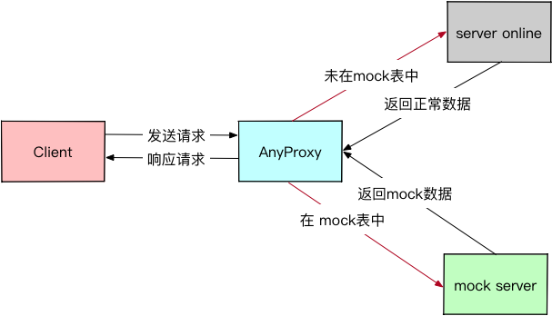
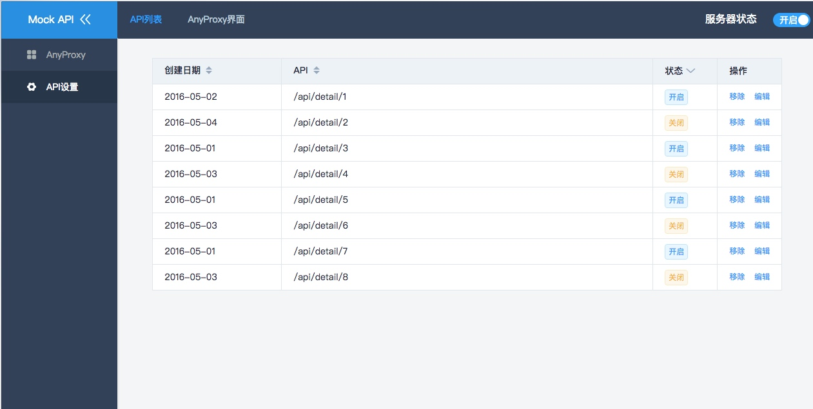
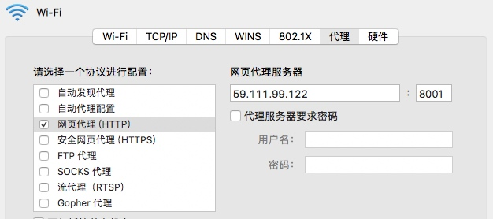
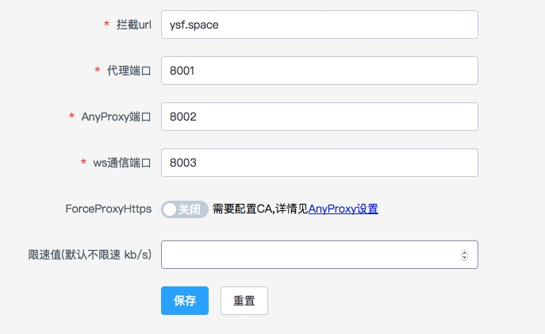

# 七鱼测试代理平台
## 前言
对于七鱼现在的业务场景,如何保证业务**高效快速**的迭代, 是我们最主要的目标。其中最重要的是如何保证各个阶段的**并行工作**， 可以划分三个阶段来思考这个问题：

1. 研发阶段的并行工作
2. 测试阶段的并行工作
3. 如何运维

现在七鱼研发阶段采用前后端分离开发（**NEI**数据mock），可以基本保证整个研发的并行化； 但是**功能测试**是需要等前端和后端**串行**结束后， 效率比较低下。
如果前端开发速度相比后端快的话， **开发** 和 **测试** 都可以使用 **七鱼测试代理平台**，进行前端状态表现的测试。

## Mock Server
技术选型：
1. Vuejs 组件库
2. Koa 服务器
3. Mongodb 数据存储
4. Anyproxy 代理

## 部署
申请网易云主机部署， 把 **mock server** 部署到云主机上。
> ssh -p 22 root@ip -i ~/.ssh/fengchao-web-dev

`mac`上设置私钥权限
> chmod 400 ~/.ssh/fengchao-web-dev

| 软件 | 版本 | 说明  |
| --- | --- | --- |
| nodejs | 7.6.0 | node环境 |
| npm | 4.4.4 | npm包环境 |
| pm2| 2.4.2 | 进程监控|
| mongodb| stable| 数据库|  
|Nginx| stable|静态资源代理服务|

## 使用说明
### 线上地址
> http://59.111.99.122/#/login

### 使用说明
打开 chrome设置 --> 更改代理服务器， 配置如下：

设置代理 `拦截url` 及 `代理端口号`

